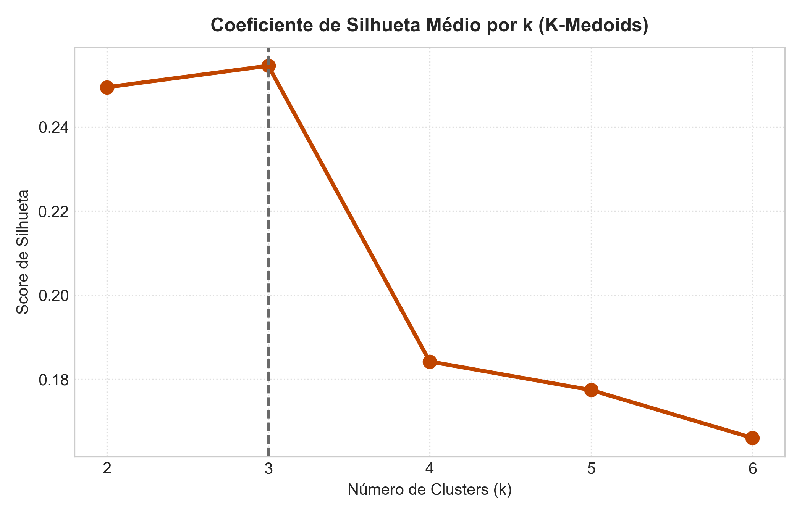
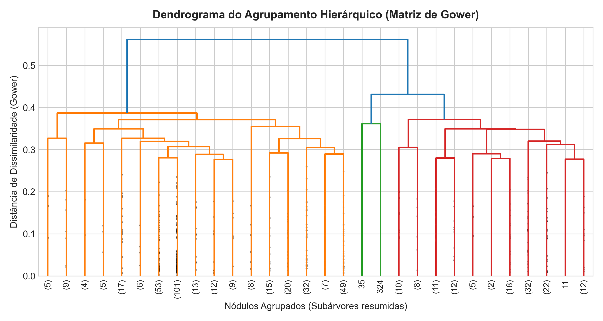
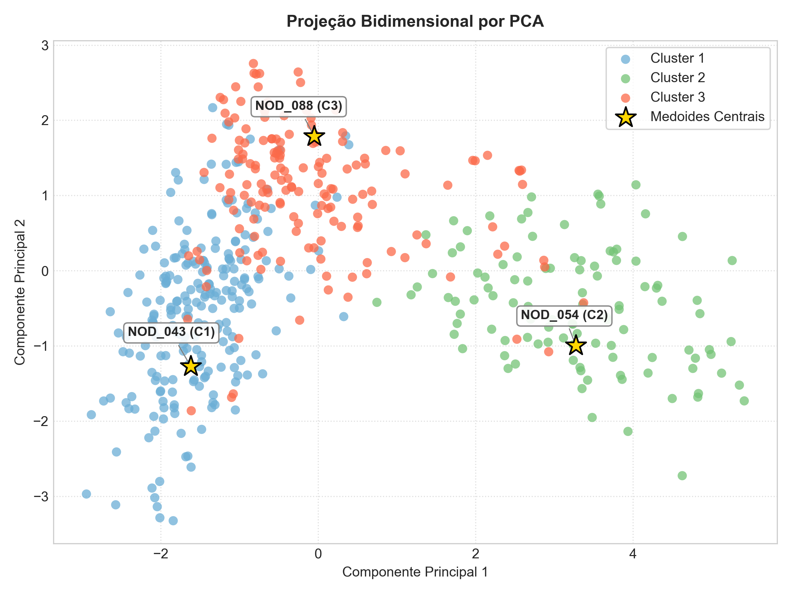
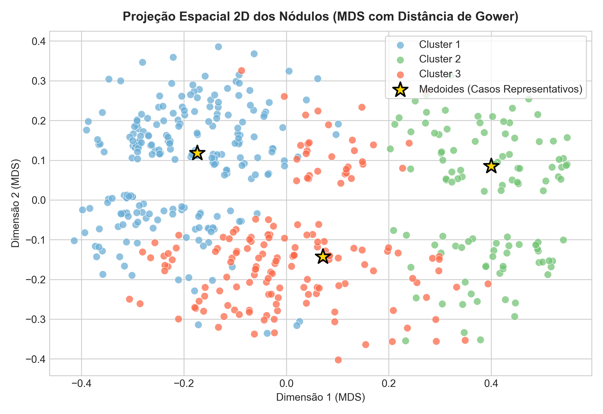

# Análise do Comportamento de Nódulos de Tireoide com Citologia Indeterminada por Meio de Algoritmos de Agrupamento de Dados

[](https://eramia-rs.sbc.org.br/2026/#/)
[](https://www.sbc.org.br/)
[](https://www.python.org/)
[](https://scikit-learn.org/)
[]()
[]()
[](https://www.ufcspa.edu.br/)

Este repositório contém a implementação do pipeline computacional de **Aprendizado de Máquina Não Supervisionado (*Clustering*)** referente ao artigo aceito/apresentado na **[ERAMIA 2026](https://eramia-rs.sbc.org.br/2026/#/) (Escola Regional de Aprendizado de Máquina e Inteligência Artificial do Rio Grande do Sul — Sociedade Brasileira de Computação - SBC)**, desenvolvido no âmbito da **Universidade Federal de Ciências da Saúde de Porto Alegre (UFCSPA)**.

> **Artigo:** *Análise do Comportamento de Nódulos de Tireoide com Citologia Indeterminada por Meio de Algoritmos de Agrupamento de Dados*  
> **Autores:** Mariana Luísa Gonçalves, Ana Trindade Winck, Luciano Costa Blomberg  
> **Afiliação:** Universidade Federal de Ciências da Saúde de Porto Alegre (UFCSPA) — Porto Alegre – RS – Brasil  
> **Evento:** ERAMIA 2026 (SBC) — [https://eramia-rs.sbc.org.br/2026/#/](https://eramia-rs.sbc.org.br/2026/#/)

---

## Sumário

- [1. Visão Geral e Motivação Clínica](#1-visão-geral-e-motivação-clínica)
- [2. Fundamentação Teórica: O Desafio dos Dados Mistos](#2-fundamentação-teórica-o-desafio-dos-dados-mistos)
- [3. Técnicas Aplicadas e Formulação Matemática](#3-técnicas-aplicadas-e-formulação-matemática)
  - [3.1. Matriz de Dissimilaridade de Gower](#31-matriz-de-dissimilaridade-de-gower)
  - [3.2. K-Medoids com Algoritmo PAM](#32-k-medoids-com-algoritmo-pam)
  - [3.3. Agrupamento Hierárquico Aglomerativo (Average Linkage)](#33-agrupamento-hierárquico-aglomerativo-average-linkage)
  - [3.4. Validação Interna: Coeficiente de Silhueta](#34-validação-interna-coeficiente-de-silhueta)
  - [3.5. Redução Dimensional e Visualização Espacial (PCA e MDS)](#35-redução-dimensional-e-visualização-espacial-pca-e-mds)
  - [3.6. Validação Clínica Cega (Sem Data Leakage)](#36-validação-clínica-cega-sem-data-leakage)
- [4. Resultados Apurados no Artigo](#4-resultados-apurados-no-artigo)
  - [4.1. Definição da Partição Ótima (k=3)](#41-definição-da-partição-ótima-k3)
  - [4.2. Perfil Morfológico e Validação com Desfecho Oncológico](#42-perfil-morfológico-e-validação-com-desfecho-oncológico)
  - [4.3. Interpretação Médica dos 3 Fenótipos Descobertos](#43-interpretação-médica-dos-3-fenótipos-descobertos)
  - [4.4. Projeções Espaciais dos Agrupamentos](#44-projeções-espaciais-dos-agrupamentos)
- [5. Dicionário de Variáveis de Entrada](#5-dicionário-de-variáveis-de-entrada)
- [6. Estrutura do Repositório](#6-estrutura-do-repositório)
- [7. Guia de Instalação e Execução](#7-guia-de-instalação-e-execução)
- [8. Citação Acadêmica (BibTeX)](#8-citação-acadêmica-bibtex)
- [9. Referências Bibliográficas](#9-referências-bibliográficas)

---

## 1. Visão Geral e Motivação Clínica

A biópsia por aspiração com agulha fina (BAAF) guiada por ultrassonografia (USG) é a abordagem primária recomendada para triagem pré-operatória de nódulos tireoidianos, categorizada internacionalmente pelo Sistema Bethesda. No entanto, entre **17% e 23%** dos procedimentos resultam em **citologias indeterminadas**:
- **Bethesda III**: Atipia de Significado Indeterminado / Lesão Folicular de Significado Indeterminado (*AUS/FLUS*).
- **Bethesda IV**: Neoplasia Folicular ou Suspeita de Neoplasia Folicular (*FN/SFN*).

Como a citologia não consegue determinar invasão vascular ou capsular, a conduta rotineira frequentemente encaminha os pacientes para ressecção cirúrgica (tireoidectomia ou lobectomia). **Contudo, 70% a 80% dessas cirurgias revelam-se desnecessárias**, confirmando lesões inteiramente benignas ao exame anatomopatológico definitivo. Embora painéis genômicos auxiliem na decisão, seu custo elevado restringe a aplicação no sistema público de saúde.

Este trabalho propõe um **pipeline de Aprendizado de Máquina Não Supervisionado** capaz de analisar padrões fenotípicos multimodais (clínicos e ultrassonográficos) em nódulos indeterminados, separando os pacientes em coortes de risco distintas e clinicamente interpretáveis.

```
                  Nódulo com Citologia Indeterminada
                         (Bethesda III / IV)
                                  │
         ┌────────────────────────┴────────────────────────┐
         ▼                                                 ▼
   Conduta Tradicional                             Abordagem ERAMIA 2026
   (Cirurgia Diagnóstica)                      (Pipeline Não Supervisionado)
         │                                                 │
   70% a 80% ressecções benignas                Descoberta de Fenótipos Naturais
   (Tratamento invasivo desnecessário)         (Baixo Risco vs Alto Risco vs Folicular)
                                                           │
                                                Suporte à Decisão Clínica
                                                (Vigilância, Biologia ou Cirurgia)
```

---

## 2. Fundamentação Teórica: O Desafio dos Dados Mistos

Em registros clínicos e laudos ultrassonográficos, as variáveis são inerentemente **heterogêneas (dados mistos)**:
- **Contínuas**: Idade (anos) e maior diâmetro do nódulo (cm).
- **Binárias / Nominais**: Sexo biológico, Microcalcificações, Halo periférico, Linfonodomegalias.
- **Politômicas / Ordinais**: Ecogenicidade (iso/hiperecoico até muito hipoecoico), Margens (regular até espiculada), Classificação de Risco ACR TI-RADS (TR2 a TR5).

### Por que o K-Means e a Distância Euclidiana são inadequados?
1. **Distorção geométrica de variáveis categóricas**: Tratar variáveis discretas codificadas numericamente como se fossem contínuas impõe relações de distância linear inexistentes.
2. **Centróides médios fictícios**: O K-Means calcula a média matemática para o centro do grupo. Em dados mistos, isso gera "pacientes virtuais" biologicamente impossíveis (ex.: sexo = 1,42; microcalcificação = 0,27).
3. **Vulnerabilidade a Outliers**: Lesões com características extremas distorcem a convergência dos centróides euclidianos.

Para solucionar essas restrições, o pipeline combina a **Métrica de Dissimilaridade de Gower** ao algoritmo particional **K-Medoids (PAM)**.

---

## 3. Técnicas Aplicadas e Formulação Matemática

```
                   ┌──────────────────────────────────────┐
                   │  Variáveis Clínicas e Ultrassonográficas │
                   │  (13 Atributos: Contínuos e Categóricos) │
                   └──────────────────┬───────────────────┘
                                      │
                                      ▼
                   ┌──────────────────────────────────────┐
                   │   Matriz de Dissimilaridade de Gower  │
                   │   D ∈ [0, 1] com Simetria e Reflexividade│
                   └──────────────────┬───────────────────┘
                                      │
                                      ▼
                   ┌──────────────────────────────────────┐
                   │ Validação Interna (Silhueta p/ k=2..6)│
                   │ Determinação do k Ótimo Global (k=3) │
                   └──────────────────┬───────────────────┘
                                      │
                   ┌──────────────────┴──────────────────┐
                   ▼                                     ▼
     ┌───────────────────────────┐         ┌───────────────────────────┐
     │    K-Medoids (Método PAM) │         │   Hierárquico Aglomerativo│
     │ Medoides Reais de Pacientes│         │       Average Linkage     │
     └─────────────┬─────────────┘         └─────────────┬─────────────┘
                   │                                     │
                   ▼                                     ▼
     ┌───────────────────────────┐         ┌───────────────────────────┐
     │  Projeções Espaciais 2D   │         │  Dendrograma de Coerência │
     │       (PCA e MDS)         │         │        Topológica         │
     └─────────────┬─────────────┘         └───────────────────────────┘
                   │
                   ▼
     ┌───────────────────────────────────────────────────┐
     │   Validação Histopatológica Cega e Perfilamento   │
     │    (Estratificação de Risco sem Data Leakage)     │
     └───────────────────────────────────────────────────┘
```

### 3.1. Matriz de Dissimilaridade de Gower
A métrica de **Gower (1971)** quantifica a dissimilaridade $D_{ij}$ entre dois nódulos $i$ e $j$ avaliados por $p$ atributos clínicos e morfológicos:

$$S_{ij} = \frac{\sum_{k=1}^{p} w_k \cdot s_{ijk}}{\sum_{k=1}^{p} w_k}, \quad D_{ij} = 1 - S_{ij}$$

onde $w_k = 1$ é o peso uniforme aplicado a cada atributo e a similaridade parcial $s_{ijk}$ varia conforme o tipo da variável:

* **Para variáveis numéricas contínuas** (idade, tamanho em cm):
  $$s_{ijk} = 1 - \frac{|x_{ik} - x_{jk}|}{R_k}$$
  sendo $R_k = \max(x_k) - \min(x_k)$ a amplitude observada da variável $k$.

* **Para variáveis categóricas, ordinais e binárias**:
  $$s_{ijk} = \begin{cases} 1, & \text{se } x_{ik} = x_{jk} \\ 0, & \text{se } x_{ik} \neq x_{jk} \end{cases}$$

O pipeline aplica correções numéricas pós-cálculo para garantir $D_{ii} = 0$, simetria exata $D_{ij} = D_{ji}$ e valores estritamente limitados no intervalo $[0, 1]$.

---

### 3.2. K-Medoids com Algoritmo PAM
Em vez de médias abstratas, o algoritmo **K-Medoids** elege **casos reais de pacientes da amostra (*medoids*)** como centros geométricos de cada agrupamento.

A implementação utiliza o método clássico **PAM (*Partitioning Around Medoids*)** (Kaufman & Rousseeuw, 1990):
1. **Fase BUILD**: Elege sequencialmente $k$ observações iniciais que minimizam a soma total das dissimilaridades aos demais pontos.
2. **Fase SWAP**: Avalia iterativamente a substituição de medoides atuais por observações não-medoides, aceitando trocas apenas quando reduzem a dissimilaridade global:
   $$\min \sum_{i=1}^{n} D(x_i, m_{\text{mais\_próximo}})$$

**Interpretabilidade Clínica:** Médicos podem auditar o caso protótipo de cada grupo, inspecionando todos os seus achados ecográficos e laudos histopatológicos.

---

### 3.3. Agrupamento Hierárquico Aglomerativo (Average Linkage)
Como método comparativo e de checagem estrutural, o pipeline constrói o dendrograma hierárquico através do critério de **Ligação Média (*Average Linkage*)**:

$$d(u, v) = \sum_{i \in u} \sum_{j \in v} \frac{D_{ij}}{|u| \cdot |v|}$$

Essa formulação não impõe restrições de esfericidade e permite avaliar a hierarquia natural das subárvores.

---

### 3.4. Validação Interna: Coeficiente de Silhueta
Para determinar a partição ótima ($k$), calcula-se o **Coeficiente de Silhueta Médio**:

$$s(i) = \frac{b(i) - a(i)}{\max(a(i), b(i))}$$

onde:
* $a(i)$ é a distância média do nódulo $i$ aos demais membros do seu próprio cluster (coesão interna).
* $b(i)$ é a distância média do nódulo $i$ aos elementos do cluster vizinho mais próximo (separação externa).

O índice varia de $-1$ a $+1$. O pipeline avalia sistematicamente o intervalo $k \in [2, 6]$.

---

### 3.5. Redução Dimensional e Visualização Espacial (PCA e MDS)
1. **Análise de Componentes Principais (PCA 2D)**: Projeção bidimensional com destaque individual e anotação dos identificadores dos medoides centrais.
2. **Multidimensional Scaling (MDS)**: Mapeamento cartesiano 2D preservando diretamente as dissimilaridades da matriz de Gower pela minimização do *Stress*:
   $$\text{Stress} = \sqrt{\sum_{i < j} \left( D_{ij} - \|\mathbf{z}_i - \mathbf{z}_j\| \right)^2}$$

---

### 3.6. Validação Clínica Cega (Sem Data Leakage)
As variáveis de desfecho oncológico cirúrgico (`cancer_de_tireoide` e `diagnostico_definitivo`) foram **rigorosamente blindadas e excluídas** durante as etapas de cálculo de distância e agrupamento.

Apenas após os clusters estarem definitivamente fixados, as taxas de malignidade histopatológica foram cruzadas de maneira cega com cada grupo fenotípico, garantindo a validade científica da estratificação.

---

## 4. Resultados Apurados no Artigo

### 4.1. Definição da Partição Ótima ($k=3$)
A avaliação da Silhueta Média identificou o pico em **$k = 3$** ($0,2545$ no K-Medoids e $0,3332$ no Agrupamento Hierárquico):

| Número de Clusters ($k$) | Coeficiente de Silhueta Médio |
| :---: | :---: |
| $k = 2$ | 0,2494 |
| **$k = 3$** | **0,2545 (Pico Ótimo)** |
| $k = 4$ | 0,1842 |
| $k = 5$ | 0,1774 |
| $k = 6$ | 0,1660 |



A inspeção do dendrograma confirma a estabilidade estrutural com 3 clados primários bem definidos:



---

### 4.2. Perfil Morfológico e Validação com Desfecho Oncológico

Cruzando os agrupamentos com os laudos histopatológicos definitivos (Tabela 1 do artigo da ERAMIA 2026):

| Atributo Clínico / USG | Cluster 1 (*Baixo Risco*) | Cluster 2 (*Alto Risco*) | Cluster 3 (*Padrão Folicular*) |
| :--- | :---: | :---: | :---: |
| **Nº de Nódulos / Proporção (%)** | 227 (45,4%) | 109 (21,8%) | 164 (32,8%) |
| **Paciente Medoide Central** | `NOD_043` | `NOD_054` | `NOD_088` |
| **Idade Média (anos)** | 51,2 | 53,0 | 53,6 |
| **Tamanho Médio (cm)** | 2,37 | 2,06 | 2,94 |
| **Citologia Bethesda IV (%)** | 33,0% (67,0% III) | 42,2% (57,8% III) | **79,3% (Predomínio IV)** |
| **Nódulo Sólido (%)** | 44,9% (Misto/Cístico) | **100,0%** | 82,3% |
| **Ecogenicidade Hipoecoica (%)** | 21,1% | **100,0%** | 68,3% |
| **Margem Irregular/Espiculada (%)** | 3,1% | **100,0%** | 29,9% |
| **Formato Mais Alto que Largo (%)** | 0,0% | **66,1%** | 3,0% |
| **Microcalcificações Presentes (%)** | 2,2% | **82,6%** | 12,2% |
| **ACR TI-RADS TR5 Alto Risco (%)** | 0,0% | **82,6%** | 8,5% |
| **TAXA REAL DE MALIGNIDADE (%)** | **9,7% (Baixo)** | **68,8% (Muito Alto)** | **28,0% (Intermediário)** |
| **Conduta Médica Sugerida** | **Acompanhamento Clínico** | **Cirurgia Imediata** | **Painel Molecular / Lobectomia** |

---

### 4.3. Interpretação Médica dos 3 Fenótipos Descobertos

* **Cluster 1 (Baixo Risco — 45,4% da amostra)**:
  - Nódulos predominantemente mistos/isoecoicos, ausência de sinais de alta suspeição ao USG (0% ACR TR5) e apenas 9,7% de malignidade pós-cirúrgica.
  - *Conduta clínica*: **Vigilância ativa e acompanhamento ultrassonográfico conservador**, prevenindo cirurgias desnecessárias em quase metade dos pacientes indeterminados.

* **Cluster 2 (Alto Risco — 21,8% da amostra)**:
  - Fenótipo marcadamente agressivo: 100% sólidos, hipoecoicos e irregulares/espiculados, com alta taxa de microcalcificações (82,6%), crescimento vertical (66,1%) e 68,8% de confirmação histopatológica de carcinoma (predominantemente carcinoma papilífero clássico).
  - *Conduta clínica*: **Indicação cirúrgica imediata (tireoidectomia)**.

* **Cluster 3 (Padrão Folicular — 32,8% da amostra)**:
  - Apresenta o maior diâmetro médio (2,94 cm) e grande predomínio citológico de Bethesda IV (79,3%), com morfologia intermediária bem delimitada e taxa de malignidade de 28,0% (neoplasias foliculares: adenoma vs. carcinoma folicular ou NIFTP).
  - *Conduta clínica*: **Candidatos prioritários à triagem molecular genômica** para decidir entre observação ou cirurgia.

---

### 4.4. Projeções Espaciais dos Agrupamentos

#### Projeção Bidimensional por PCA (com destaque para os Medoides Reais)
As estrelas douradas representam os pacientes centrais protótipos de cada perfil (`NOD_043`, `NOD_054` e `NOD_088`):



#### Projeção Não Linear por Multidimensional Scaling (MDS)
Mapeamento da topologia da matriz de Gower em duas dimensões:



---

## 5. Dicionário de Variáveis de Entrada

O pipeline aceita arquivos CSV delimitados por ponto e vírgula (`;`) contendo os seguintes atributos clínico-ultrassonográficos:

| Campo | Tipo | Descrição Clínica e Codificação |
| :--- | :---: | :--- |
| `id_paciente` | Texto | Identificador anonimizado do paciente (ex.: `PAC_001`) |
| `id_nodulo` | Texto | Identificador anonimizado do nódulo (ex.: `NOD_001`) |
| `idade` | Numérico | Idade do paciente (anos) |
| `sexo` | Categórico | Sexo biológico (`1`: Feminino, `2`: Masculino) |
| `citologia` | Categórico | Categoria Bethesda (`3`: Bethesda III, `4`: Bethesda IV) |
| `usg_tamanho_nodulo_maior` | Numérico | Maior diâmetro mensurado ao ultrassom (em cm) |
| `usg_conteudo_nodulo` | Categórico | Composição (`1`: Cístico/Espongiforme, `2`: Sólido, `3`: Misto) |
| `usg_ecogenicidade_nodulo` | Categórico | Ecogenicidade (`1`: Iso/Hiperecoico, `2`: Hipoecoico, `3`: Muito Hipoecoico) |
| `usg_contorno_nodulo` | Categórico | Margens (`1`: Regular, `2`: Irregular, `3`: Espiculada) |
| `usg_formato` | Categórico | Relação dimensional (`1`: Mais largo que alto, `2`: Mais alto que largo) |
| `usg_halo_nodulo` | Categórico | Halo periférico (`1`: Presente/Completo, `2`: Ausente/Incompleto, `99`: Não avaliado) |
| `usg_fluxo_nodulo` | Categórico | Padrão Doppler (`1`: Periférico, `2`: Misto, `3`: Central) |
| `usg_microcalcificacoes` | Binário | Focos ecogênicos pontuais (`0`: Ausente, `1`: Presente) |
| `usg_linfonodos` | Binário | Linfonodos cervicais regionais (`0`: Habitual/Normal, `1`: Suspeito) |
| `usg_acr_nodulo` | Categórico | Classificação ACR TI-RADS estimada (`2`: TR2 a `5`: TR5) |
| `cancer_de_tireoide` | Binário (Externo) | Padrão-ouro histopatológico (`0`: Benigno, `1`: Maligno) — *Apenas validação* |
| `diagnostico_definitivo` | Texto (Externo) | Diagnóstico anatomopatológico conclusivo pós-ressecção — *Apenas validação* |

---

## 6. Estrutura do Repositório

```text
├── .gitignore                      # Regras de exclusão (dados brutos, PDFs, arquivos temporários)
├── README.md                       # Documentação técnica completa e fundamentação teórica
├── requirements.txt                # Dependências mínimas do ambiente Python
├── pipeline_clustering.py          # Implementação completa do pipeline de agrupamento
└── resultados/                     # Gráficos e sumário descritivo gerados pelo modelo
    ├── curva_silhueta_kmedoids.png
    ├── dendrograma_hierarquico.png
    ├── projecao_pca_bidimensional.png
    ├── projecao_mds_gower.png
    ├── dispersao_clusters_pca_mds.png
    └── perfil_clinico_clusters.csv # Tabela agregada com o perfil morfológico e taxas de câncer
```

---

## 7. Guia de Instalação e Execução

### Pré-requisitos
- Python 3.10 ou superior
- Git

### 1. Clonar o repositório
```bash
git clone https://github.com/SEU_USUARIO/NOME_DO_REPOSITORIO.git
cd NOME_DO_REPOSITORIO
```

### 2. Criar e ativar o ambiente virtual
```bash
# Windows (PowerShell):
python -m venv .venv
.venv\Scripts\Activate.ps1

# Linux / macOS:
python3 -m venv .venv
source .venv/bin/activate
```

### 3. Instalar dependências
```bash
pip install -r requirements.txt
```

### 4. Executar o pipeline de agrupamento
Para executar o modelo sobre a sua base tabular:
```bash
python pipeline_clustering.py caminho/para/sua_base.csv
```

O script executará automaticamente:
1. Leitura e isolamento das 13 variáveis clínico-ultrassonográficas;
2. Cálculo da matriz de Gower com simetria estrita;
3. Avaliação da Silhueta para determinação do $k$ ótimo;
4. Execução do K-Medoids (PAM) e Agrupamento Hierárquico;
5. Projeções bidimensionais (PCA e MDS) destacando os medoides reais;
6. Validação histopatológica cega;
7. Exportação de todas as figuras e da tabela descritiva em `resultados/perfil_clinico_clusters.csv`.

---

## 8. Citação Acadêmica (BibTeX)

Se você utilizar este pipeline ou os resultados em sua pesquisa, por favor cite o artigo publicado na ERAMIA 2026:

```bibtex
@inproceedings{goncalves2026eramia,
  title     = {An{\'a}lise do Comportamento de N{\'o}dulos de Tireoide com Citologia Indeterminada por Meio de Algoritmos de Agrupamento de Dados},
  author    = {Gon{\c{c}}alves, Mariana Lu{\'i}sa and Winck, Ana Trindade and Blomberg, Luciano Costa},
  booktitle = {Anais da Escola Regional de Aprendizado de M{\'a}quina e Intelig{\^e}ncia Artificial do RS (ERAMIA 2026)},
  year      = {2026},
  location  = {Porto Alegre, RS, Brasil},
  publisher = {Sociedade Brasileira de Computa{\c{c}}{\~a}o (SBC)},
  url       = {https://eramia-rs.sbc.org.br/2026/#/}
}
```

---

## 9. Referências Bibliográficas

* **CIBAS, E. S.; ALI, S. Z.** The 2017 Bethesda System for Reporting Thyroid Cytopathology. *Thyroid*, v. 27, n. 11, p. 1341–1346, 2017.
* **FACELI, K. et al.** *Inteligência Artificial: Uma Abordagem de Aprendizado de Máquina*. 2. ed. Rio de Janeiro: LTC, 2021.
* **GOWER, J. C.** A General Coefficient of Similarity and Some of Its Properties. *Biometrics*, v. 27, n. 4, p. 857–871, 1971.
* **HAN, J.; KAMBER, M.; PEI, J.** *Data Mining: Concepts and Techniques*. 3. ed. Waltham: Morgan Kaufmann, 2011.
* **HORNE, J. et al.** Challenges of Clustering Multimodal Clinical Data. *JMIR Medical Informatics*, v. 8, n. 5, e16452, 2020.
* **JASSAL, K. et al.** Beyond genomics: artificial intelligence powered diagnostics for indeterminate thyroid nodules – A systematic review and meta-analysis. *Frontiers in Endocrinology*, v. 16, 1506729, 2025.
* **KAUFMAN, L.; ROUSSEEUW, P. J.** *Finding Groups in Data: An Introduction to Cluster Analysis*. New York: John Wiley & Sons, 1990.
* **NEGRELLI, M. et al.** Artificial Intelligence in Thyroid Cytopathology: Diagnostic and Technical Insights. *Cancers*, v. 17, n. 21, 3525, 2025.
* **ROUSSEEUW, P. J.** Silhouettes: A graphical aid to the interpretation and validation of cluster analysis. *Journal of Computational and Applied Mathematics*, v. 20, p. 53–65, 1987.
* **TAN, P.-N. et al.** *Introduction to Data Mining*. 2. ed. Boston: Pearson, 2018.
